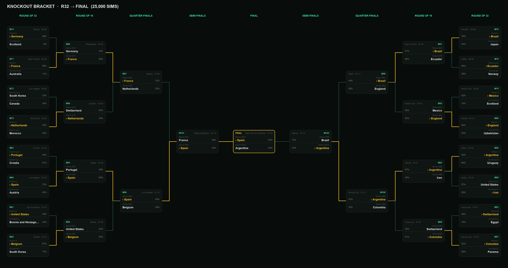
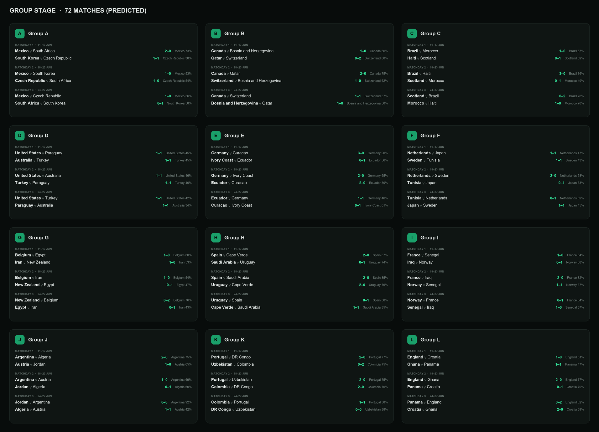

<div align="center">

# ⚽ Football ML — FIFA World Cup 2026 Prediction Engine

**Calibrated football match & tournament forecasting.**
Dixon‑Coles bivariate Poisson ⊕ a calibrated CatBoost ensemble, trained on
**49k+ real international matches (1872–2026)**, served via a FastAPI ML API and a
modern Next.js 16 frontend.

<br/>


**60.4% W/D/L accuracy · RPS 0.167 · excellent calibration · zero mock data**

</div>

---

## 🖼️ Preview

### 🏆 Knockout bracket — mirrored R32 → Final, Monte‑Carlo to champion (25,000 simulations)

The official FIFA 2026 bracket, with each slot filled by its **most‑likely occupant**
and the champion's path highlighted in gold — all probabilities derived from the same
calibrated model that powers the match predictor.

<div align="center">
  
</div>

### 📅 Group stage — all 72 matches predicted

Every group, every matchday: predicted scoreline and most‑likely result with its probability.

<div align="center">
  
</div>

> Both images are generated programmatically from live API output (no manual screenshots):
>
> ```bash
> curl -s "http://localhost:8000/api/wc2026/schedule"        -o sched.json
> python scripts/render_group_stage.py sched.json web/public/images/group-stage-wc26.png
>
> curl -s "http://localhost:8000/api/wc2026/bracket?n=25000" -o bracket.json
> python scripts/render_bracket.py    bracket.json web/public/images/knockout-bracket-wc26.png
> ```

---

## ✨ Features

- **Any‑match predictor** — Win/Draw/Loss probabilities, expected goals, full
  Poisson **score‑matrix**, BTTS & over/under markets, **head‑to‑head record**,
  both teams' **26‑man squads with current‑season form** (club goals/assists +
  real international goals), and a **"who's‑missing" what‑if**.
- **One unified model everywhere** — the match predictor, the group schedule, and
  the tournament simulation all call the *same* calibrated match function, so a
  given matchup is identical on every screen (no more contradictions).
- **World Cup 2026** — the official **104‑match schedule** (72 group + 32 knockout),
  the real FIFA **bracket with connector arrows** (R32 → Final + 3rd‑place), and a
  **Monte‑Carlo simulation** (up to 25k runs) to champion probability.
- **Squad & XI intelligence** — the **real 26‑man squads** for all **48 World Cup
  teams** (scraped from Wikipedia, announced 2 Jun 2026), a **projected 4‑3‑3
  starting XI**, each player's **real international goal form**, and a
  **"who's‑missing" what‑if**. Player ability is overlaid from FIFA‑24 ratings.
- **Honest metrics** — accuracy, **Ranked Probability Score (RPS)**, Brier, a
  **calibration reliability diagram**, and a **binary‑market backtest** showing
  where 85–97% accuracy genuinely lives.

> **On accuracy:** 3‑way W/D/L has a structural ceiling of ~62–64% (even bookmaker
> closing odds resolve to ~55–58%). This model hits **60.4%** with **RPS 0.167** and
> excellent calibration — the metrics professional forecasters actually optimize.
> All predictions are **model‑derived from real data — no mock/dummy values.**

---

## 🏗️ Architecture

```
                 ┌─────────────────────┐      HTTP/JSON      ┌────────────────────┐
   Browser  ───► │  Next.js 16 (web/)  │ ─────────────────► │  FastAPI (api/)    │
                 │  TS · Tailwind      │ ◄───────────────── │  ML prediction API │
                 └─────────────────────┘                    └─────────┬──────────┘
                                                                       │ loads
                                              ┌────────────────────────┼───────────────┐
                                              ▼                        ▼               ▼
                                        models/ (.joblib)     src/ (ML library)   data/ (parquet)
                                        DC + CatBoost stack    Elo · DC · features  features + Elo
```

The Python side owns **all** modelling; the frontend is a pure consumer of the API.

---

## 📁 Project structure

```
football/
├── api/                  # FastAPI backend (ML prediction API)
│   └── main.py
├── src/                  # Python ML library
│   ├── elo.py                # online Elo rating engine
│   ├── dixon_coles.py        # Dixon-Coles bivariate Poisson model
│   ├── features.py           # rolling form, head-to-head, rest-days
│   ├── squad.py              # FIFA-24 squad strength + projected XI
│   ├── player_perf.py        # real international goal form + club xG
│   ├── wc2026_config.py      # official 2026 groups + name aliases
│   └── wc2026_bracket.py     # official knockout bracket + 3rd-place rule
├── scripts/              # runnable entry points
│   ├── download_data.py      # fetch all datasets (no API key)
│   ├── fetch_wc2026_squads.py# real 26-man WC2026 squads from Wikipedia
│   ├── download_player_perf.py# current-season (2025/26) EPL form (FPL API)
│   ├── train.py              # baseline pipeline (CatBoost + DC)
│   ├── train_pro.py          # "pro" stacked ensemble + calibration + backtest
│   ├── render_bracket.py     # render the knockout-bracket PNG from API output
│   └── render_group_stage.py # render the group-stage PNG from API output
├── web/                  # Next.js 16 frontend (TS + Tailwind)
│   ├── app/                  # Home, Predict, World Cup, Squads pages
│   ├── components/           # Nav, ExtensionErrorGuard
│   ├── lib/api.ts            # typed API client
│   └── public/images/        # generated README screenshots
├── notebooks/            # 01–06 exploratory pipeline (JupyterLab)
├── tools/                # jh_client.py (THM GPU), build_notebooks.py
├── data/                 # datasets (gitignored — regenerate via scripts)
├── models/               # trained artifacts (gitignored — regenerate)
├── outputs/              # saved predictions/sims (gitignored)
├── requirements.txt
└── LICENSE
```

---

## 🚀 Quick start

### 1. Backend (Python ≥ 3.10)

```bash
pip install -r requirements.txt

python scripts/download_data.py         # datasets + FIFA-24 ratings (~3 min, no key)
python scripts/fetch_wc2026_squads.py   # real 26-man WC2026 squads (48 teams) from Wikipedia
python scripts/download_player_perf.py  # current-season (2025/26) EPL player form (FPL API)
python scripts/train_pro.py             # train the pro ensemble (CPU; --gpu for CUDA)

python -m uvicorn api.main:app --port 8000     # ML API → http://127.0.0.1:8000
```

> A fresh clone has no `models/` or `data/` (they're gitignored). Run the
> `download_data.py` → `train_pro.py` steps once to generate them, then start the API.

### 2. Frontend (Node ≥ 20.9)

```bash
cd web
npm install
npm run dev                          # http://localhost:3000  (Next.js 16, Turbopack)
```

The frontend reads `NEXT_PUBLIC_API_BASE` (defaults to `http://127.0.0.1:8000`);
CORS for `localhost:3000` is enabled on the API.

---

## 🧠 Model stack

| Component | What it does |
|---|---|
| **Elo engine** (`src/elo.py`) | Online team ratings; K scaled by competition + goal diff; leak‑free pre‑match snapshot |
| **Dixon‑Coles** (`src/dixon_coles.py`) | Bivariate Poisson with attack/defense per team, home advantage, low‑score correction; time‑decayed MLE → full score matrix |
| **CatBoost stack** (`scripts/train_pro.py`) | Gradient‑boosted W/D/L classifier (+optional LightGBM/XGBoost), **isotonic‑calibrated** |
| **Ensemble blend** | 50% calibrated ML + 50% Dixon‑Coles |
| **Squad‑strength tilt** (`src/squad.py`) | Bounded adjustment from the **current 26‑man squad** (club tier + 2025/26 form + intl goals) — current players move the prediction without overriding the trained model |
| **Unified core** (`api/main.py` `_match_core`) | Single cached function = blend ⊕ squad tilt; used by predictor, schedule AND simulation → fully consistent |
| **Monte‑Carlo** (`api/main.py`) | Plays the **real FIFA bracket** with the official best‑third assignment, sampling from the unified model → stage & champion probabilities |

**Why not "50% H2H + 50% players"?** Head‑to‑head alone is noisy and weak (decades‑old
results barely predict a 2026 match); a naïve 50% weight *lowers* accuracy. Instead the
trained, calibrated model is the backbone (H2H is one of its features), and current
squad strength is a **bounded** tilt on top — better than either signal alone.

### Measured performance (held‑out 2018–2026)

| Metric | Value |
|---|---|
| W/D/L accuracy (calibrated) | **60.4%** |
| Ranked Probability Score ↓ | **0.167** |
| Home / Away goals MAE | **1.00 / 0.82** |
| Over 0.5 goals (backtest) | **91.4%** |
| Double‑chance favourite | **84.3%** |

---

## 🔌 API reference

| Method | Route | Description |
|---|---|---|
| `GET` | `/api/teams` | All teams + Elo |
| `GET` | `/api/metrics` | Model metrics |
| `GET` | `/api/markets` | Backtested binary‑market accuracy |
| `GET` | `/api/calibration` | Reliability‑diagram bins |
| `POST`| `/api/predict` | `{home, away, neutral, home_out[], away_out[]}` → probabilities, xG, score matrix, markets |
| `GET` | `/api/squads` | Squad strength for all nations |
| `GET` | `/api/squad/{team}` | Strength + projected XI + intl goal form (`?exclude=`) |
| `GET` | `/api/wc2026/schedule` | All 72 group matches (predicted) |
| `GET` | `/api/wc2026/simulation?n=` | Full‑tournament Monte‑Carlo |
| `GET` | `/api/wc2026/bracket?n=` | Official bracket with modal occupants |

Interactive docs at `/docs` (Swagger).

---

## 📊 Data sources (all free, no API key)

| Source | Data |
|---|---|
| [martj42/international_results](https://github.com/martj42/international_results) | 49k international matches + goalscorers (1872–2026) |
| [football-data.co.uk](https://www.football-data.co.uk) | Club leagues + closing odds |
| FIFA‑24 player dataset | Player ability overlay (squad strength) |
| **Fantasy Premier League API** | **Current‑season (2025/26) EPL goals/assists/xG/minutes** (`scripts/download_player_perf.py`) |
| Wikipedia | Real announced **26‑man WC2026 squads** (`scripts/fetch_wc2026_squads.py`) |
| [StatsBomb open data](https://github.com/statsbomb/open-data) | Event data incl. xG (index) |

> **Note on current player data:** FBref (the only complete cross‑league source) blocks
> automated requests (HTTP 403), so full‑world current club stats can't be auto‑downloaded.
> The system combines what *is* reliably reachable: real current EPL stats (FPL) + real
> international goals (all players) + current‑club tier — a robust cross‑league signal.

---

## ⚡ Optional: GPU training on THM JupyterHub

```bash
python tools/jh_client.py whoami
python tools/jh_client.py upload-dir . football
# then in a GPU JupyterLab terminal:
cd football && python scripts/train_pro.py --gpu
```

Credentials live in `.env` (gitignored — copy from `.env.example`). Rotate the THM
token at `https://jl.mni.thm.de/hub/token` if it was ever shared.

---

## 🗺️ Roadmap

- Live club xG enrichment (Understat/FBref) for the projected XI
- Encode FIFA's exact best‑third combination table (vs. valid bipartite matching)
- Hyperparameter tuning (Optuna) + tuned ensemble weights
- Dockerfile + CI for one‑command deploy

---

## 📄 License

MIT — see [LICENSE](LICENSE).
